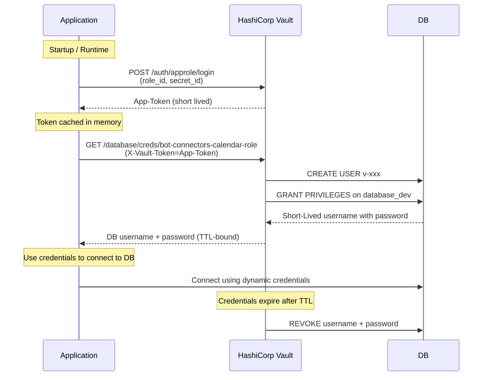

#### Table of Contents

[1. Prerequisites](#1-prerequisites)

[2. Vault - Installation and Setup](#2-vault---installation-and-setup)

[3. vault.hcl - minimal config](#3-vaulthcl---minimal-config)

[4. Initialize and Unseal](#4-initialize-and-unseal)

[5. Audit Logging](#5-audit-logging)

[6. Activate Database Secrets Engine](#6-activate-database-secrets-engine)

[7. MariaDB: User and Privileges](#7-mariadb-user-and-privileges)

[8. Create a Vault Role (creation_statements)](#8-create-a-vault-role-creation_statements)

[9. AppRole (optional) & Policy](#9-approle-optional--policy)

[10. Testing and Debugging](#10-testing-and-debugging)

---

## 1. Prerequisites

- A virtial machine or cloud instance with REHL 10 is up and running.
- MariaDB 10.11.x is installed and running.
- `vault` CLI is installed
- Root-Token and Unseal-Keys are saved offline.

---

## 2. Vault - Installation and Setup

Run the following command to display the current version of the installed Vault and
enable it.

```
vault version
sudo systemctl enable --now vault
sudo systemctl status vault
```

If errors are thrown by systemctl check the logs via

`sudo journalctl -xeu vault.service --no-pager`

Some errors: port 8200 is already in use or bugs in vault.hcl.
E.g. if you have HTTPS and HTTP Listeners enabled in your `vault.hcl` file, you
will get an error if both are pointing to a path with the same port such as 8200
---

## 3. `vault.hcl` - minimal config

You can find your `vault.hcl` file in `/etc/vault.d/vault.hcl`.
Make sure you have the rights to edit this file.

A minimal config can look like this:

```hcl
ui = true
disable_mlock = true

storage "raft" {
  path    = "/opt/vault/data"
  node_id = "vault-node-1"
}

listener "tcp" {
  address     = "127.0.0.1:8200"
  tls_disable = true    # Nur für Tests / lokal. Aktivieren in Prod!
}

cluster_addr = "http://127.0.0.1:8201"
api_addr     = "http://127.0.0.1:8200"

```

Make sure there is a folder `/opt/vault/data` and that the user running vault has
the rights to write to this folder.
If not, create it manually.

``` 
sudo mkdir -p /opt/vault/data && sudo chown vault:vault /opt/vault/data
```

---

## 4. Initialize and Unseal

If you have not done so already, initialize and unseal Vault.
You can do so by running the following commands:

`vault operator init`
This command will output the Root-Token and the Unseal-Keys.
Save these keys offline.

You need at least 3 Unseal-Keys to unseal Vault.

```
vault operator unseal <UnsealKey1>
vault operator unseal <UnsealKey2>
vault operator unseal <UnsealKey3>
```

Now Vault is ready to use.

You can login with the Root-Token:

`vault login <RootToken>`

And verify: `vault status`

## 5. Audit Logging

To enable audit logging, run the following command:

```
sudo mkdir -p /var/log/vault && sudo chown vault:vault /var/log/vault
vault audit enable file file_path=/var/log/vault/audit.log
```

---

## 6. Activate Database Secrets Engine

To activate the Database Secrets Engine, run the following command:

`vault secrets enable database`

Now create the DB-Config. You can choose as a name whatever you want. In our use case we
chose `mariadb-config`.
`bot-connectors-dev`. This name is only **vault specific**. It has nothing to do with
the database itself.
Next, we have to configure the config for vault:

``` 
vault write database/config/bot-connectors-dev \
  plugin_name="mysql-database-plugin" \
  connection_url="{{username}}:{{password}}@tcp(127.0.0.1:3306)/" \
  allowed_roles="bot-connectors-role" \
  username="<VAULT_USR_NAME>" \
  password="<VAULT_USR_PASSWORD>"
```

For Dev-Stage and Testing Use-Cases, the MariaDB-Instance is running on the same host as
Vault.
So we can use `127.0.0.1` in the `connection_url`.
**Note:** The `connection_url` is important for vault because this is how the actual
connection to the MariaDB Instance is established.
---

## 7. MariaDB: User and Privileges

Login to MariaDB as a root user and create a new user to interact with vault.

```
CREATE USER 'vault_usr'@'%' IDENTIFIED BY '<password>';
```

Now the critical part: Grant all privileges on to the new user.

**Important:** Make sure to use the `with grant option` clause. If you don't, the user
won't be able to grant privileges to other users. As a result, a user would be created
but trying to grant privileges to this user would fail.

```
GRANT ALL PRIVILEGES ON calendar_connectors_dev.* TO 'vault_usr'@'%' WITH GRANT OPTION;
FLUSH PRIVILEGES;
```

---

## 8. Create a Vault Role (creation_statements)

The Role is important because it connects the database config (vault internal) with the
actual DB.
Further, it defines which statements are executed when an application requests a secret
from vault for this DB.

```
vault write database/roles/bot-connectors-role \
  db_name="bot-connectors-dev" \
  creation_statements="CREATE USER '{{name}}'@'%' IDENTIFIED BY '{{password}}'; GRANT ALL PRIVILEGES ON calendar_connectors_dev.* TO '{{name}}'@'%';" \
  default_ttl="1h" \
  max_ttl="2h"
```

---

## 9. AppRole (optional) & Policy

It is recommended to use AppRole authentication instead of the default token
authentication. HashiCorp Vaults AppRole authentication was configured
to allow an application to securely access dynamic database credentials
without using a root token or environment-based secrets.

---

### 9.1 Goal

Enable an application (e.g. Python service, Docker container) to authenticate
against Vault using **AppRole** and retrieve dynamic database credentials.

The application should:

- Not use a root token
- Not store long-lived secrets in `.env` files
- Only have the minimum required permissions

---

### 9.2 Runtime View



#### Description

### Runtime Authentication Flow (AppRole)

1. The application starts and loads its RoleID and SecretID
2. The application authenticates against Vault using AppRole
3. Vault issues a short-lived client token
4. The application uses the token to request dynamic database credentials
5. Vault creates a temporary database user with limited privileges
6. The application connects to the database using these credentials
7. Credentials automatically expire and are revoked by Vault

---

To create your AppRole, create an `.hcl`-File defining the AppRole and the Policy.

```hcl
path "database/creds/bot-connectors-role" {
  capabilities = ["read"]
}
```

And apply:

`vault policy write connectors-policy connectors-policy.hcl`

Create the AppRole:

```hcl
vault auth enable approle

vault write auth/approle/role/connectors-app \
  token_ttl=1h token_max_ttl=24h policies="connectors-policy"

vault read auth/approle/role/connectors-app/role-id
vault write -f auth/approle/role/connectors-app/secret-id
```

The role_id can be part of the App-Config e.g. in a container image.
But the secret_id should be stored securely. E.g. injecting it at runtime.

**Never place the secret_id in your repository!**

## 10. Testing and Debugging

Test the connection to the database by running the following command:

`vault read database/creds/bot-connectors-calendar-role`

It should return a username and password with its corresponding TTL.
